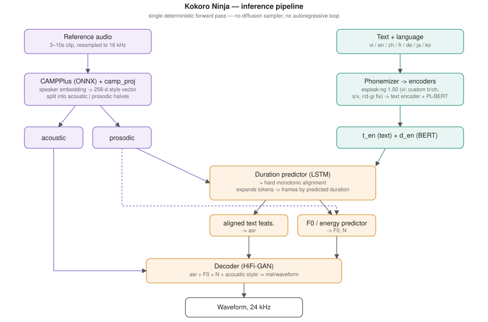

# Kokoro Ninja 🥷

**Fast Vietnamese text-to-speech with zero-shot voice cloning.** Give it a few seconds of
someone's voice and any Vietnamese text, and it speaks in that voice — at **~15× realtime on a
single GPU**.

[StyleTTS2](https://github.com/yl4579/StyleTTS2) + a
[CAMPPlus](https://github.com/modelscope/3D-Speaker) speaker encoder, fine-tuned on ~2,160
hours of Vietnamese. One non-autoregressive forward pass: no diffusion sampler, no
autoregressive decode loop. That's where the speed comes from, and it makes generation
deterministic — same input, same output.

## Architecture



## Install

```bash
git clone https://github.com/primepake/kokoro-ninja
cd kokoro-ninja
pip install -r requirements.txt
```

**espeak-ng 1.50 is required.** The model was trained on 1.50's phoneme output; newer versions
drift the IPA and audibly degrade quality. Most distros ship 1.51/1.52, so build it:

```bash
git clone --depth 1 --branch 1.50 https://github.com/espeak-ng/espeak-ng
cd espeak-ng && ./autogen.sh && ./configure --prefix=$HOME/.local/espeak150 && make -j && make install
```

Then put the weights bundle in `checkpoints/`. `config_inference.yml` resolves the asset paths
relative to itself, so keep it beside them:

```
checkpoints/
├── config_inference.yml
├── vi_campplus.pth
├── campplus/campplus.onnx
└── Utils/{ASR,JDC,PLBERT}/...
```

## Usage

```python
import soundfile as sf
from kokoro_ninja import KokoroNinja

tts = KokoroNinja.load(
    checkpoint_path="checkpoints/vi_campplus.pth",
    config_path="checkpoints/config_inference.yml",
    campplus_onnx_path="checkpoints/campplus/campplus.onnx",
    device="cuda:0",
)

style = tts.compute_style("reference.wav")        # 3-10s of the voice to clone
wav, sr = tts.synthesize(
    text="Xin chào, đây là giọng nói được nhân bản.",
    ref_s=style,
)
sf.write("output.wav", wav, sr)
```

`compute_style()` is per-voice — compute it once and reuse it for every sentence in that voice.

## Benchmarks

Measured on one NVIDIA L4, VIVOS test split, 10 held-out speakers × 3 sentences, same
references and sentences for every system:

| System | RTF ↓ | ×realtime | SECS ↑ | UTMOSv2 ↑ | WER ↓ |
|---|---|---|---|---|---|
| **Kokoro Ninja** | **0.069** | **14.6×** | 0.887 | 2.465 | 5.1% |
| omnivoice-vietnamese | 0.437 | 2.3× | 0.916 | 2.702 | 2.6% |
| VieNeu-TTS v3 Turbo | 0.718 | 1.4× | 0.931 | 2.422 | 3.3% |
| *human recording* | — | — | *0.914* | *3.008* | *5.7%* |

Honestly: **we win on speed by 6–10×** and tie on naturalness, but **speaker similarity trails**
the autoregressive models — 0.887 against a 0.833 floor (two different speakers) and a 0.914
ceiling (the same speaker's other recordings). If you need maximum timbre fidelity from one
clip rather than throughput, VieNeu v3 Turbo is currently better. Intelligibility is at the
ASR's own floor: our 5.1% WER is below the human recordings' 5.7%.

RTF is full-utterance compute ÷ audio duration, not time-to-first-audio. SECS is scored with
WavLM-base-plus-sv rather than CAMPPlus, since scoring with the encoder the model is
conditioned on would flatter it. WER is PhoWhisper back-transcription, which catches wrong
tones because a wrong tone is a different Vietnamese word.

## Vietnamese phonemization

espeak-ng's `vi` voice collapses phonemically distinct onsets into one IPA token, which makes
them unlearnable. `kokoro_ninja/phonemize_vi.py` fixes the three that matter:

| written | espeak gives | should be |
|---|---|---|
| `tr` vs `ch` | both `tʃ` | `ʈ` vs `tʃ` |
| `s` vs `x` | both `s` | `ʂ` vs `s` |
| `r` vs `d`/`gi` | all `z` | `ʐ` vs `z` |

It phonemizes per syllable, looks at the written onset and remaps the colliding phoneme to the
right retroflex — already in the vocabulary, so no vocab change. Guarded: it only fires when
espeak actually emitted the colliding token. (`c`/`k`/`q` → `k` is left alone — a genuine
merger in Vietnamese.)

## Limitations

- **Speaker similarity** trails the best autoregressive/codec models (see above).
- **Vietnamese only** in this release.
- **No text normalization.** Expand numbers, dates and currency before synthesis — this is the
  most common source of real-world errors in Vietnamese TTS and it is not handled here.
- Noisy or very short (<3s) references degrade cloning; there is no built-in denoiser.
- 24 kHz output, no streaming.

## Licence

Code: **Apache-2.0** ([LICENSE](LICENSE)).

Built on [StyleTTS2](https://github.com/yl4579/StyleTTS2) (MIT),
[CAMPPlus / 3D-Speaker](https://github.com/modelscope/3D-Speaker) (Apache-2.0), and
[espeak-ng](https://github.com/espeak-ng/espeak-ng) (GPL-3.0, used as a separate runtime
library). Model weights ship separately and carry their own licence — check the weights card
before commercial use.
